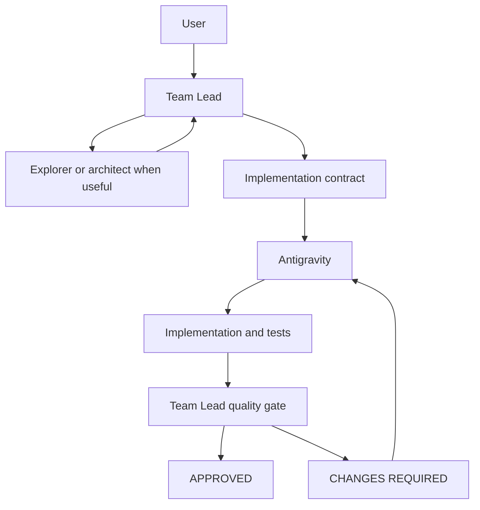

# AI Engineering Orchestrator

Cost-aware multi-agent software engineering.

Use expensive reasoning for decisions. Use a cost-efficient model for implementation.

**Safe by default:** AEO does not replace your existing `AGENTS.md`, `CLAUDE.md`, global Codex config, Claude settings, MCP servers, or custom agents. Installation is project-scoped, namespaced, merge-safe, and reversible.



## Overview

The Team Lead understands the task, looks at the repository, writes a bounded contract, and decides whether the result is acceptable. The Implementation Engineer does the substantive editing and does not approve its own work.

MCP lets the Team Lead call the implementation model. The policy file decides when and why that delegation should happen.

| Piece | What it contributes |
| --- | --- |
| MCP bridge | Capability: `delegate_antigravity`, `apply_delegation`, `discard_delegation`; fallback `delegate_cursor` |
| `AGENTS.md` or `CLAUDE.md` | Policy |
| Model | Reasoning |
| Repository and tests | Evidence |
| Team Lead | Final authority |

This is a local reference implementation. It is not a hosted orchestrator.

## Motivation

Strong coding models are expensive. Spending them on multi-file implementation, and then spending them again to review that same typing, is the cost this design is meant to reduce.

Keep the expensive model on requirements, architecture, decomposition, review, verification, conflict resolution, and the final decision. Send features, bug fixes, refactors, tests, integrations, migrations, and revisions to a cost-efficient implementation model.

Cheaper is user-relative, not provider-absolute. The economics depend on your subscription, region, education or student discounts, usage limits, provider pricing, and workload. This reference implementation uses Gemini via Antigravity as the Implementation Engineer. In the author's current setup, Gemini is significantly more cost-effective because it is accessed through a discounted student Google AI Pro plan. Treat that as an example, not a universal pricing claim. See [docs/cost-aware-routing.md](docs/cost-aware-routing.md).

Independent review and a maker/checker split are useful consequences. They are not the primary reason for the split.

The architecture is designed to reduce unnecessary use of expensive Team Lead reasoning by delegating implementation work. This repository does not measure or guarantee a savings number.

## Architecture

Two presets are included:

- Codex as Team Lead, Gemini through Antigravity as Implementation Engineer
- Claude Code as Team Lead, Gemini through Antigravity as Implementation Engineer

Supporting roles are not a ladder. Discovery, design, review, and trivial edits stay separate jobs. AEO installs them under namespaced ids (`aeo_explorer`, `aeo_architect`, `aeo_reviewer`, `aeo_fast_worker` on Codex; `aeo-explorer`, `aeo-architect`, `aeo-reviewer`, `aeo-fast-worker` on Claude) so they do not replace agents you already have. Antigravity implements. The Team Lead decides.

The roles are Team Lead and Implementation Engineer. Substantive implementation goes to Gemini via Antigravity (`delegate_antigravity`) by default. When Antigravity cannot run, the policy falls back to Cursor via `delegate_cursor` on `aeo-cursor` with the same contract and quality gate—not to ad hoc Team Lead implementation. See [bridge/cursor-mcp](bridge/cursor-mcp/README.md).

Details and a second diagram are in [docs/architecture.md](docs/architecture.md). The four workflow figures are in [diagrams/architecture.md](diagrams/architecture.md).

## Core principles

- Substantive implementation uses Antigravity by default. The Team Lead does not bypass it because it could write the code itself.
- Trivial edits stay small: a typo, a comment, formatting, an obvious rename, a tiny config correction.
- The Team Lead records `git status --short` before substantive work and attributes later edits only from that baseline.
- `agent_success` is a report, not approval.
- APPROVED and CHANGES REQUIRED are the only gate outcomes. Revisions go back to Antigravity.
- No cost meter, failover, telemetry product, or cloud control plane is included. Do not document those as if they exist.

## Supported presets

| Team Lead | Policy fragment | Installer merge |
| --- | --- | --- |
| OpenAI Codex | [presets/codex/orchestration-block.md](presets/codex/orchestration-block.md) | Managed block in the project `AGENTS.md`, namespaced agents, and a project `.codex/config.toml` block |
| Claude Code | [presets/claude/rules/aeo-orchestration.md](presets/claude/rules/aeo-orchestration.md) | `.claude/rules/aeo-orchestration.md`, namespaced agents, one `.mcp.json` server, and one permission |

Both say the same thing about substantive work: Antigravity is the mandatory default Implementation Engineer.

Model names in the Codex agent files are examples. Replace them with models your account provides. You may customize agent model settings. AEO tracks installed file hashes, so normal updates preserve modified agent files instead of silently replacing them.

## Prerequisites

- Node.js 20 or newer. The installer exits before writing when Node is older.
- The Antigravity CLI (`agy`) on `PATH`, or `AGY_BIN` pointing at it
- An interactive `agy` login before headless runs
- Codex or Claude Code for the Team Lead preset you want to use

`npm test` in the bridge does not need `agy` credentials.

## Quick start

Run a dry-run before the install. AEO modifies Codex and Claude project configuration only inside the target project, and only AEO-owned names. Global Codex config and global Claude config are not modified unless `--global`. Recovery backups for shared files are stored separately under `~/.aeo/backups/<project-id>/<timestamp>/` (or `~/.aeo/backups/global/<timestamp>/` in global mode). Those backups are recovery material. Uninstall does not restore an older backup over newer user config.

```bash
# Project install
node scripts/aeo.mjs install --target C:/path/to/project --codex --claude --dry-run
node scripts/aeo.mjs install --target C:/path/to/project --codex --claude
node scripts/aeo.mjs doctor --target C:/path/to/project

# Global install (user scope)
node scripts/aeo.mjs install --global --codex --claude --dry-run
node scripts/aeo.mjs install --global --codex --claude
node scripts/aeo.mjs doctor --global
```

1. Clone or download this repository.
2. Confirm the Antigravity CLI works: `agy -p "Reply with the single word ready." --mode accept-edits --output-format json --print-timeout 2m`
3. Dry-run, then install into the target project.
4. Read the change summary. Backups of shared files that AEO actually changes are under `~/.aeo/backups/<project-id>/<timestamp>/` (or `~/.aeo/backups/global/<timestamp>/`).
5. Start a new Codex or Claude session.
6. Run doctor.
7. Run [Test B](examples/smoke-test.md). Test B does not name Antigravity. A substantive fix should still be delegated.

Pass `--codex`, `--claude`, or both. If you pass neither, the installer stops instead of guessing. `install.ps1` and `install.sh` call the same Node command. `update` is the same reconcile as `install`. It refreshes AEO material that still matches the last installed bytes. It does not overwrite agent files, the Claude orchestration rule, bridge source, or the interior of an AEO block after you edit them. `--force-managed-update` is the explicit opt-in for that replacement, and it backs up the drifted file first. That opt-in applies only to files and blocks the active install manifest already owns. Markers alone are not ownership. If `AGENTS.md` or `.codex/config.toml` already contains an AEO block and the manifest does not own it, the installer stops and leaves that block unchanged. Matching AEO content is not treated as proof of ownership. If an AEO-namespaced file already exists but is not recorded in the active install manifest, AEO preserves it and reports a collision. The file may come from a manual copy, an older setup, or an install that stopped before the manifest was saved, and matching bytes do not give AEO the right to delete it.

Codex loads `<project>/.codex/config.toml` only when the project is trusted. AEO does not change trust. Trust the project in the normal Codex UX if the project config does not appear. Codex CLI and Codex IDE share configuration layers, which is why the installer does not edit `~/.codex/config.toml`, `~/.codex/AGENTS.md`, `~/.claude/CLAUDE.md`, `~/.claude/settings.json`, or `~/.claude.json` unless `--global`.

The manual merge, if you do not want the installer, is in [docs/install.md](docs/install.md).

## Antigravity bridge setup

The server is [bridge/antigravity-mcp](bridge/antigravity-mcp/README.md).

```bash
cd bridge/antigravity-mcp
npm install
npm test
```

`npm test` spawns the server on stdio and checks that the tools (`delegate_antigravity`, `apply_delegation`, `discard_delegation`) are listed. A live edit still needs a logged-in `agy`:

```bash
agy -p "Reply with the single word ready." --mode accept-edits --output-format json --print-timeout 2m
```

The bridge calls `agy` with `--mode accept-edits`, `--output-format json`, and `--print-timeout 15m`. It kills the process at 16 minutes. Set the client tool timeout higher than that. The Codex example uses 1200 seconds. A current `agy --help` shows an unset print timeout of `0s` (wait until the turn finishes), so the bridge sets the limit itself. Worktree isolation (`isolation: "worktree"`) runs the engineer in a detached worktree for parallel delegations, applied via `apply_delegation` and cleaned up with `discard_delegation`.

## Cursor bridge (fallback)

[bridge/cursor-mcp](bridge/cursor-mcp/README.md) exposes `delegate_cursor` for the same Implementation Engineer contract when Antigravity is unavailable. Register `aeo-cursor` manually (see the bridge README and [presets/claude/mcp-entry.cursor.example.json](presets/claude/mcp-entry.cursor.example.json)). The installer copies only the Antigravity bridge today.

## What installation changes

AEO owns only namespaced files, managed blocks, and the `aeo-antigravity` MCP entry.

Codex, inside the target project:

- append or update the marked block in `AGENTS.md`
- append or update the marked block in `.codex/config.toml`
- add `.codex/agents/aeo-explorer.toml`, `aeo-architect.toml`, `aeo-reviewer.toml`, and `aeo-fast-worker.toml`

Claude, inside the target project:

- add `.claude/rules/aeo-orchestration.md`
- add `.claude/agents/aeo-explorer.md`, `aeo-architect.md`, `aeo-reviewer.md`, and `aeo-fast-worker.md`
- add `mcpServers["aeo-antigravity"]` to `.mcp.json`
- append `mcp__aeo-antigravity__delegate_antigravity` to `.claude/settings.local.json` when that exact string is missing

The bridge is copied to `<project>/.aeo/bridge/antigravity-mcp/` and its dependencies are installed there. `AGY_BIN` is used when it is set. Otherwise the bridge runs `agy` from `PATH`.

The project Codex block does not set your model, reasoning effort, sandbox, approval policy, or trust. `CLAUDE.md` is never modified. Existing MCP servers and agents stay. A second install reconciles AEO-owned content and does not duplicate blocks or entries.

Even AEO-owned files become user-controlled once you edit them. AEO records the version it installed and refuses to silently overwrite drifted files.

`uninstall` removes unchanged managed blocks, the namespaced files whose bytes still match the manifest, and the AEO MCP and permission entries. A customized AEO file or block is left in place and reported. It does not restore an older backup over edits you made later. If AEO created a file and nothing of yours remains, that file can be deleted. `--force-remove-modified` also deletes customized AEO files. A customized block that uninstall keeps is a preserved orphaned AEO block: the manifest entry that owned it is removed on purpose, and a later install will not adopt or overwrite it.

`status` and `doctor` only read. Doctor does not change configuration. `status` reports each known AEO file as owned and unchanged, owned and drifted, present but not owned, or missing. An unowned file stays `PRESENT BUT NOT OWNED` even when its bytes match the preset. Doctor reports that collision and does not repair it.

## Codex and Claude files

Do not copy a preset over `AGENTS.md`, `CLAUDE.md`, `config.toml`, or `.mcp.json`. The fragments in `presets/` are what the installer merges. Model names inside the AEO agent files are examples. Change `model`, `model_reasoning_effort`, or `developer_instructions` in `.codex/agents/aeo-*.toml`, and `model`, `effort`, `tools`, or the instructions in `.claude/agents/aeo-*.md`, when your account uses different slugs. The same applies to `.claude/rules/aeo-orchestration.md`. AEO tracks installed file hashes, so a normal update preserves those edits. That does not change the model in your user Codex config.

## Permissions

[antigravity/settings.example.json](antigravity/settings.example.json) is a headless implementation profile: accept edits, do not leave the trusted development directory, allow a few git and test commands, deny destructive git. Replace `C:\path\to\development` before use. If `~/.gemini/antigravity-cli/settings.json` does not exist, that example can be a starting point. If the file already exists, keep it and merge only the fields you intend to change. Do not replace the whole file. The installer does not own or write this global Antigravity settings file. Antigravity authentication stays in the native user settings.

Fields you may need to merge include `agentMode`, `toolPermission`, `artifactReviewPolicy`, `trustedWorkspaces`, and `permissions`. Adapt the permission policy to your own trust model. The example values are not a requirement to replace choices you already made.

Allowing commands to run without a prompt increases trust. Keep that limited to a repository you control. The bridge does not disable permission checks. Read [docs/permissions.md](docs/permissions.md) before widening the allow list.

## Smoke test

[examples/smoke-test.md](examples/smoke-test.md) has two prompts.

Test A names `aeo_explorer`, `aeo_architect`, Antigravity, and `aeo_reviewer` so you can see each hop. On Claude Code, use the hyphenated names (`aeo-explorer`, and the matching architect, reviewer, and fast-worker ids).

Test B only says:

> Inspect the refresh-token lifecycle problem, implement the necessary production-ready correction, add appropriate regression coverage, and verify the result without unnecessarily changing the architecture.

If Antigravity is invoked for that substantive fix without being named, the policy is working.

Other assignments: [feature](examples/feature-task.md), [bug fix](examples/bug-fix-task.md), [high-risk change](examples/high-risk-task.md).

## How routing works

Analysis uses repository evidence, `aeo_explorer` or `aeo-explorer` when a search is worth it, and `aeo_architect` or `aeo-architect` when the design is consequential.

Implementation of a trivial edit stays with the Team Lead or `aeo_fast_worker` / `aeo-fast-worker`. Substantive implementation goes to Antigravity through the `aeo-antigravity` server.

Review is the Team Lead's reading of the diff, plus `aeo_reviewer` or `aeo-reviewer` when a second challenge is worth the cost. CHANGES REQUIRED returns to Antigravity.

The economic version of that choice is [docs/cost-aware-routing.md](docs/cost-aware-routing.md). Why the tool alone will not cause the route is [docs/policy-vs-capability.md](docs/policy-vs-capability.md).

## Security model

Example files contain no keys. Do not add any. Permission examples deny push, reset, clean, rebase, merge, and commit. The Team Lead still has to read the diff. Private vulnerability reports go through GitHub Security Advisories. See [SECURITY.md](SECURITY.md).

## Troubleshooting

[docs/troubleshooting.md](docs/troubleshooting.md) covers a missing MCP server, a stale session, `agy` not found, headless auth, permission denials, timeout mismatch, an empty diff, a Team Lead that never delegates, and a Team Lead that delegates typos.

## Repository structure

```text
ai-engineering-orchestrator/
├── README.md
├── LICENSE
├── SECURITY.md
├── CONTRIBUTING.md
├── .gitignore
├── .github/workflows/bridge.yml   credential-free bridge and installer tests
├── bridge/antigravity-mcp/    MCP server, tests, and bridge README
├── presets/codex/             orchestration fragment, config fragment, namespaced agents
├── presets/claude/            orchestration rule, MCP fragment, namespaced agents
├── scripts/aeo.mjs            install, update, uninstall, status, and doctor
├── install.ps1                Windows wrapper for scripts/aeo.mjs
├── install.sh                 shell wrapper for scripts/aeo.mjs
├── antigravity/settings.example.json
├── docs/
├── examples/
└── diagrams/architecture.md
```

The bridge also contains `lib/` and `test/`. Those are the implementation and the automated checks, not extra products.

A local `node_modules` directory can exist in a working tree without belonging in a source archive. Pack tracked files with `git archive --format=zip --prefix=ai-engineering-orchestrator/ -o aeo-source.zip HEAD`. See [Source archive](docs/install.md#source-archive).

## Contributing

Policy changes have to keep the Team Lead and the Implementation Engineer apart, in both presets. See [CONTRIBUTING.md](CONTRIBUTING.md).

## License

[MIT](LICENSE).

## Further reading

- [Safe installation](docs/install.md)
- [Implementation contracts](docs/implementation-contract.md)
- [Quality gate](docs/quality-gate.md)
- [Revision loop](docs/revision-loop.md)
- [Permissions](docs/permissions.md)
