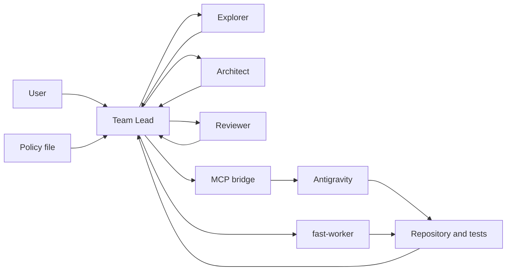
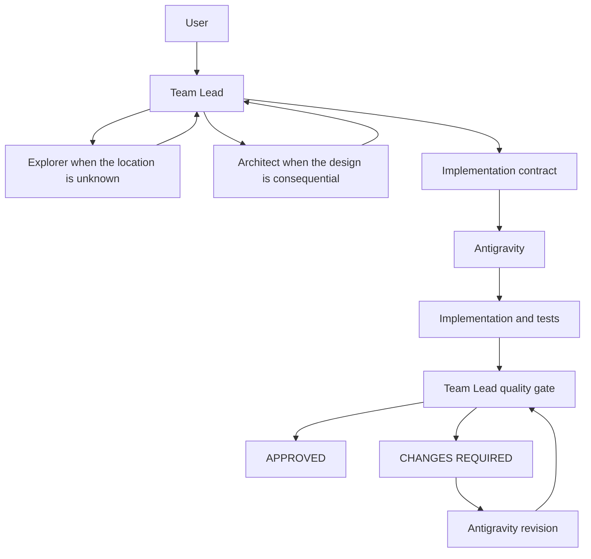
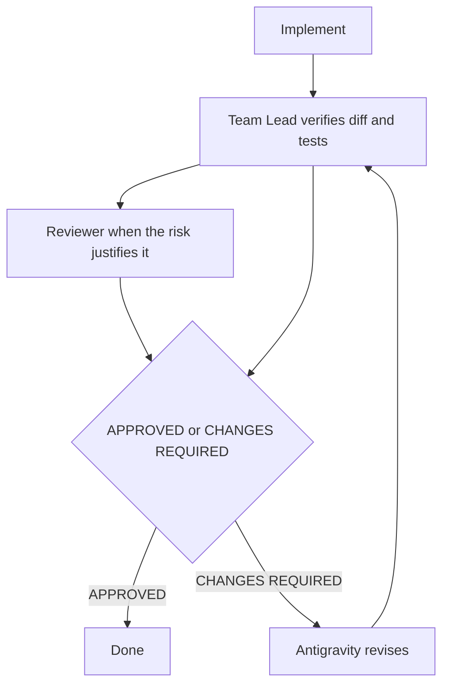
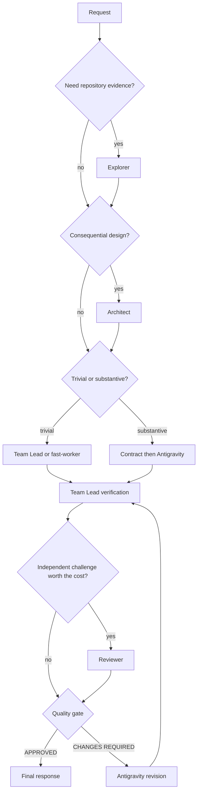

# Diagrams

These figures match the runtime in this repository. The Team Lead is Codex or Claude Code. The Implementation Engineer is Antigravity. Boxes are roles, not extra services.

## Overall architecture

The policy file is an AEO managed block in the project `AGENTS.md` for Codex, and `.claude/rules/aeo-orchestration.md` for Claude Code. Existing project instructions stay in place. The bridges expose `delegate_antigravity` on `aeo-antigravity` and `delegate_cursor` on `aeo-cursor`. The diagram still uses the job names. Installed ids are `aeo_explorer` / `aeo-explorer`, `aeo_architect` / `aeo-architect`, `aeo_reviewer` / `aeo-reviewer`, and `aeo_fast_worker` / `aeo-fast-worker`. fast-worker is drawn beside the bridge because it is a different, narrower path: trivial edits only.

## Substantive implementation

## Revision loop

Reviewer is optional. The decision stays with the Team Lead either way.

## Cost-aware routing

A trivial edit does not enter the Antigravity path. A substantive edit does not stay on the Team Lead or on fast-worker. Uncertain size is substantive.
