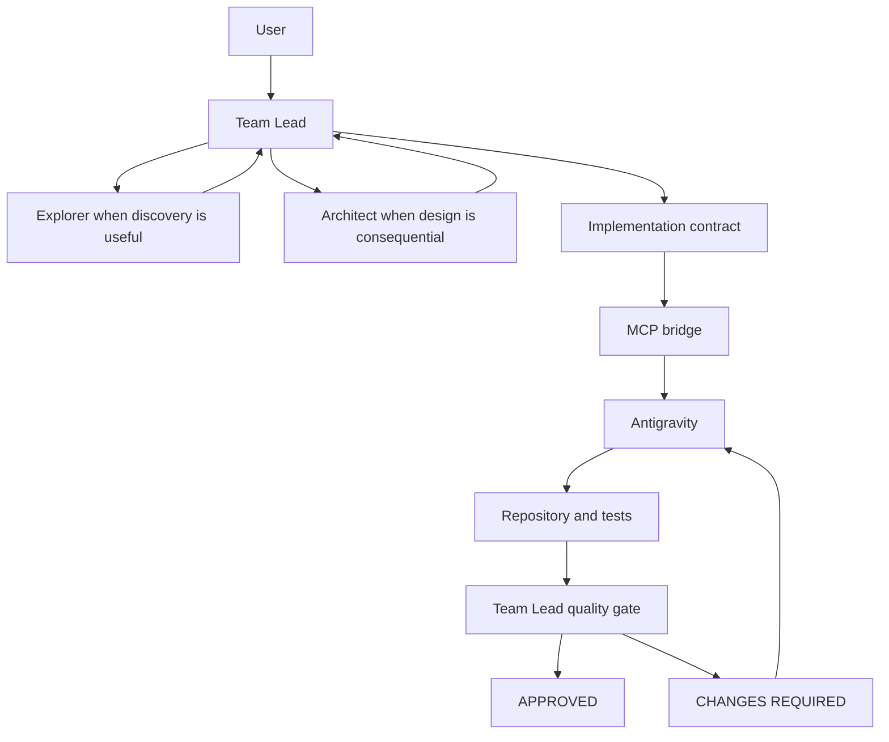

# Architecture

Cost-aware AI engineering orchestration separates an expensive decision role from a cost-efficient implementation role. Which model is cost-efficient depends on the user's subscriptions, region, limits, and discounts. See [cost-aware routing](cost-aware-routing.md).

The Team Lead understands the objective, looks at repository evidence, writes a bounded contract, and decides whether the result is acceptable. The Implementation Engineer inspects the repository and does the substantive editing. Native supporting agents discover, design, or challenge. They do not replace either of those two roles.

The current reference mapping is:

- Team Lead: Codex or Claude Code
- Implementation Engineer: Gemini through the Antigravity CLI

A future mapping can send the same Implementation Engineer role to another CLI or MCP-backed coding model. The policy should keep talking about the role. These presets name the current tool: `delegate_antigravity`.

## Parts

| Part | What it is |
| --- | --- |
| Team Lead | Codex or Claude Code. Final authority. |
| Implementation Engineer | Antigravity, for substantive edits and revisions. |
| Explorer | Lower-effort, read-only discovery. Installed as `aeo_explorer` or `aeo-explorer`. |
| Architect | Design reasoning when the blast radius justifies it. Installed as `aeo_architect` or `aeo-architect`. |
| Reviewer | An independent challenge. No approval power. Installed as `aeo_reviewer` or `aeo-reviewer`. |
| fast-worker | A trivial mechanical edit only. Installed as `aeo_fast_worker` or `aeo-fast-worker`. |
| MCP bridge | The capability that lets the Team Lead call Antigravity. The server id is `aeo-antigravity`. |
| Policy | Codex: an AEO block in the project `AGENTS.md`. Claude: `.claude/rules/aeo-orchestration.md`. Existing `AGENTS.md` and `CLAUDE.md` text stays. |
| Repository and tests | The evidence used at the quality gate. |

The bridge does not choose the route. A model does not become the authority because it edited the files. See [policy versus capability](policy-vs-capability.md).

## Evidence flow

1. The user states an objective.
2. The Team Lead records `git status --short` before substantive work.
3. Explorer returns files and symbols when the Team Lead does not already know where the change lives.
4. Architect returns constraints when the design is consequential. The Team Lead still owns the decision.
5. The Team Lead writes an [implementation contract](implementation-contract.md) and calls `delegate_antigravity` with the absolute repository path.
6. Antigravity edits inside that directory and returns a completion report. The bridge labels the run `agent_success`, `agent_failure`, `cli_failure`, `timeout`, or `validation_failure`.
7. The Team Lead compares the working tree with the baseline, reads the diff, and runs or checks the relevant tests.
8. Reviewer may challenge the diff. The Team Lead checks material findings, including any claim about who edited a file.
9. The Team Lead chooses APPROVED or CHANGES REQUIRED. A required revision goes back to Antigravity.

## What is not in this repository

There is no orchestrator service, no queue, and no router that measures tokens and picks a vendor. Routing is the Team Lead following the policy file. The bridge forwards token counts when the Antigravity CLI reports them. It does not price those tokens or fail over to another provider.

The diagrams in [../diagrams/architecture.md](../diagrams/architecture.md) show the same flow in more detail: overall structure, the substantive path, the revision loop, and the routing decision.
