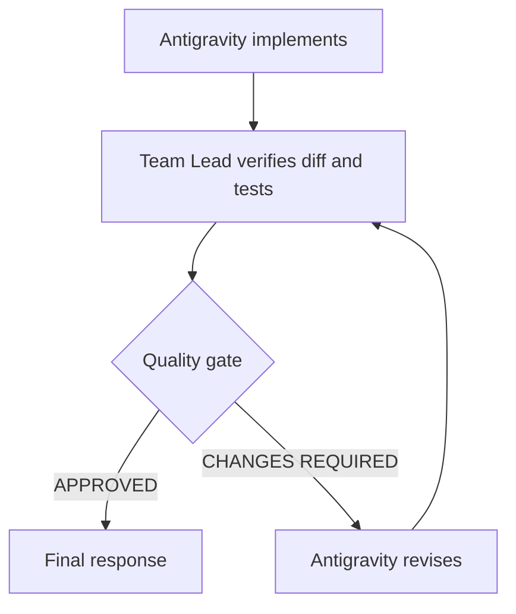

# Revision loop

Substantive work is a loop, not a single handoff.

## Implement

The Team Lead sends a bounded [contract](implementation-contract.md) through `delegate_antigravity`. The engineer edits inside `cwd` and returns the seven-part report.

## Verify

The Team Lead compares the tree with the baseline, reads the diff, and checks the tests. Reviewer may inspect the same diff when the risk justifies it. Reviewer still does not close the loop.

## Reject

CHANGES REQUIRED is a normal outcome. The revision prompt names the original objective, the evidence, the correction, and the acceptance lines. It tells the engineer to inspect the current code and revise it, not to restart, unless the approach cannot be repaired.

The Team Lead does not absorb a substantive revision just because the finding is clear. The finding goes back to the Implementation Engineer. A one-line mechanical fix after an otherwise approved change can stay with the Team Lead. A behavioral correction does not.

## Revise

Antigravity changes the existing implementation. For worktree-isolated delegations, pass the same `delegationId` (with `isolation: "worktree"`) so the engineer continues inside the existing worktree with earlier progress preserved. Do not run two delegations against the same `delegationId` at the same time. The next report must say what was corrected and which commands actually ran.

## Re-review

The Team Lead verifies again. A new baseline is not required for files the engineer just changed, but unexpected files still need an explanation against the previous status. Repeat until the gate can approve, or until a missing requirement needs the user.

A timeout, a CLI failure, or an agent failure is not a revision. Those mean the run did not produce an implementation to review. Fix the tooling or send the assignment again. Do not describe that failed run as a passing change.

Similarly, `apply_conflict` is not a revision. It means the patch failed `git apply --check` because the main tree moved or overlaps since the base commit. Discard the delegation with `discard_delegation` and re-delegate against the current HEAD, or reconcile manually. Never ask Antigravity to rebase or merge. Applying the same delegation twice also returns `apply_conflict`.

See [quality gate](quality-gate.md) for the approval criteria.
